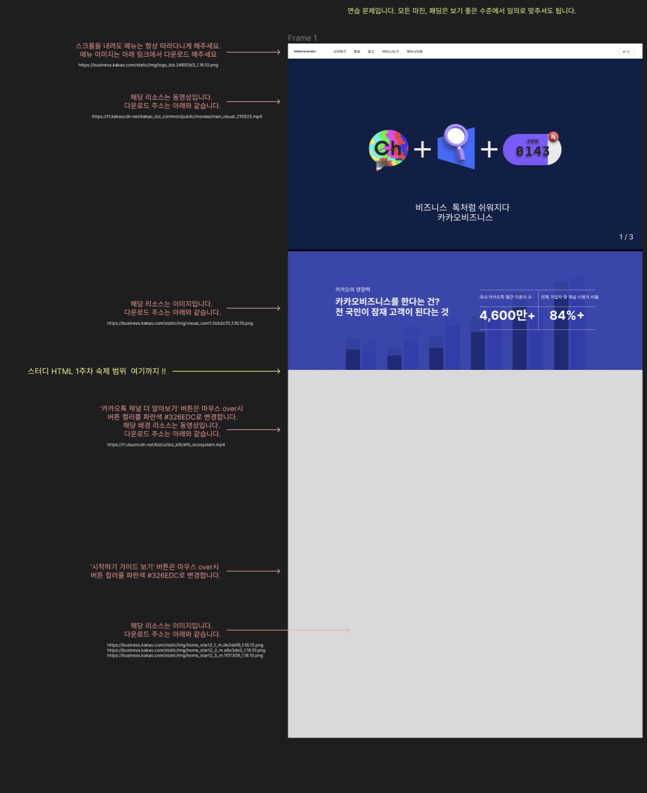

# 1주차 숙제

* 아래 그림과 같이 제작하기

## 리소스

* https://business.kakao.com/static/img/logo_biz.34693d3_1.16.10.png
* https://t1.kakaocdn.net/kakao_biz_common/public/movies/main_visual_210525.mp4
* https://business.kakao.com/static/img/visual_cont1.0cb2c10_1.16.10.png
* https://t1.daumcdn.net/biz/ui/biz_kfb/kfb_ecosystem.mp4

* https://business.kakao.com/static/img/home_start2_1_m.de2da16_1.16.10.png
* https://business.kakao.com/static/img/home_start2_2_m.a6e3de2_1.16.10.png
* https://business.kakao.com/static/img/home_start2_3_m.1f01309_1.16.10.png

